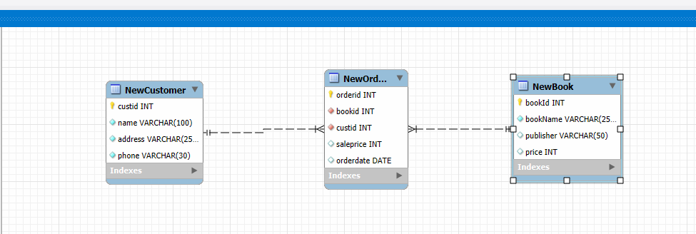

# iot-Database-2025
IoT 개발자 데이터베이스 저장소

## 1일차
- 데이터베이스 시스템
    - 통합된 데이터를 저장해서 운영하면서, 동시에 여러사람이 사용할 수 있도록 하는 시스템
    - 실시간 접근, 계속 변경, 동시 공유 가능, 내용으로 참조(물리적으로 떨어져있어도 사용 가능)

    - DBMS - SQL sever, Oracle, MySQL, MariaDB, MongoDB...

- 데이터베이스 언어
    - SQL - Structured Query Language. 구조화된 질의 언어(프로그래밍언어와 동일)
        - DDL : DB나 테이블 생성, 수정, 삭제 언어
        - DML : 데이터를 검색, 삽입, 수정, 삭제
        - DCL : 권한 부여, 해제 제어 언어

- MySQL 설치(Docker) 
    1. 파워셀을 오픈
    ```shell
    > docker - v
        Docker version 27.5.1, build 9f9e405
    ```
    2. MySQL Docker 이미지 다운로드
    ```shell
    > Docker pull mysql
        23d22e42ea50: Download complete
        431b106548a3: Download complete
        df1ba1ac457a: Download complete
        f56a22f949f9: Download complete
        43759093d4f6: Download complete
        893b018337e2: Download complete
        277ab5f6ddde: Download complete
        d255dceb9ed5: Download complete
        2be0d473cadf: Download complete
        cc9646b08259: Downloading [=======================>                           ]  62.91MB/135.7MB
        ...
        Digest: sha256:146682692a3aa409eae7b7dc6a30f637c6cb49b6ca901c2cd160becc81127d3b
        Status: Downloaded newer image for mysql:latest
        docker.io/library/mysql:latest
    ```
    3. MySQL Image 확인
    ```shell
    > docker images
    PS C:\Users\Admin> docker images
    REPOSITORY   TAG       IMAGE ID       CREATED       SIZE
    mysql        latest    146682692a3a   4 weeks ago   1.09GB
    ```
    4. Docker 컨테이너 생성
        - MySQL Port 번호는 기본 3306 으로 되어있음.
        - Oracle 은 Port 1521
        - SQL Server 1433
    ```shell
    > docker run --name mysql-container -e MYSQL_ROOT_PASSWORD=12345 -d -p 3306:3306 mysql:latest
    ```
    5. 컨테이너 확인
    ```shell
    > docker ps -a
    CONTAINER ID   IMAGE          COMMAND                   CREATED          STATUS          PORTS                  NAMES

    03845eb84e27   mysql:latest   "docker-entrypoint.s…"   18 seconds ago   Up 18 seconds   0.0.0.0:3306->3306/tcp, 33060/tcp   mysql-container
    ```

    6. Docker 컨테이너 시작, 중지, 재시작
    ```shell
    > docker stop mysql-container       # 중지
    > docker start mysql-container      # 시작
    > docker restart mysql-container    # 재시작
    ```
    7. MySQL Docker 컨테이너 접속
    ```shell
    > docker exec -it mysql-container bash # bash리눅스의 powershell
        bash-5.1#
    > mysql -u root -p
        Enter password: # <- 12345 (커서안움직임)
        Welcome to the MySQL monitor.  Commands end with ; or \g.
        Your MySQL connection id is 9
        Server version: 9.2.0 MySQL Community Server - GPL

        Copyright (c) 2000, 2025, Oracle and/or its affiliates.

        Oracle is a registered trademark of Oracle Corporation and/or its
        affiliates. Other names may be trademarks of their respective
        owners.

        Type 'help;' or '\h' for help. Type '\c' to clear the current input statement.

        mysql> show databases;
        +--------------------+
        | Database           |  
        +--------------------+
        | information_schema |
        | mysql              |
        | performance_schema |
        | sys                |
        +--------------------+
        4 rows in set (0.02 sec)
    ```


- Workbanch 설치
    - https://dev.mysql.com/downloads/workbench/    
    - MySQL Installer에서 Workbench, sample 만 설치

    - workbanch 실행 후

- 관계 데이터 모델
    - 3단계 DB 구조 : 외부 스키마(실세계와 매핑) -> 개념 스키마(DB논리적 설계) -> 내부 스키마(물리적 설계) -> DB
    - 모델에 쓰이는 용어
        - 릴레이션 - 테이블과매핑
        - 속성 - 테이블 컬럼(Column)
        - 튜블 - 테이블 행(row)
        - 관계 - 릴레이션 간의 부모,자식 연관
    
    - #### 무결성 제약조건
        - 키 - **기본키(Priamary key)**, **외래키**, 슈퍼키, 후보키, 대리키, 대체키
        - 개체 무결성 제약조건, 참조 무결성 제약조건, 도메인 무결성 제약조건


- SQL 기초
    - SQL 개요

    ```sql
    -- DML SELECT문
    SELECT publisher, price
      FROM Book
     WHERE bookname = '축구의 역사'; -- 주석입니다.
    ```

## 2일차
-  SQL 기초
    - 개요
        - 데이터베이스에 있는 데이터를 추출 및 처리작업을 위해서 사용되는 프로그래밍언어
        - 일반 프로그래밍 언어와의 차이점
            - DB에서만 문제를 해결 가능
            - 입출력을 모두 DB에서 테이블로 처리
            - 컴파일 및 실행은 DBMS가 수행
    - DML(데이터 조작어) - 검색, 삽입, 수정, 삭제
        - SELECT, INSERT, UPDATE, DELETE
    - DDL(데이터 정의어)
        - CREATE, ALTER, DROP
    - DCL(데이터 제어어)
        - GRANT, REVOKE

- DML 중 SELECT

    ```sql
     SELECT [ALL|DISTINCT] 컬럼명(들)
       FROM 테이블(들)
     [WHERE 검색조건(들)]
     [GROUP BY 속성이름(들)]
    [HAVING 집계함수 검색조건(들)]
     [ORDER BY 정렬할속성(들) [ASC|DESC]]
      [WITH ROLLUP]
    ```

- 쿼리 연습(정렬까지) : [SQL](./day02/db02_Select쿼리연습.sql)
- 쿼리 연습(집계함수부터) : [SQL](./day02/db03_SELECT_집계함수_GROUP%20BY.sql)

## 3일차
- Visual Studio Code 에서 MySQL 연동
    - 확장 > MySQL 검색 > 
        - Weijan Chen 개인개발자 만든 MySQL 확장도 준수(추천)
        - Weijan Chen 이개발한 Database Client 설치.
        - Database Client 는 많은 DB연결이 가능!
        - Oracle에서 개발한 MySQL Shell for VS Code 를 사용 하지말것(불편-)
    - Database Client
        1. 툴바 Database 아이콘 클릭
        2. Create Connection 클릭
        3. 정보 입력 > 연결 테스트

            

        4. WorkBench 처럼 사용

            


- #### SQL 기초
    - 기본 데이터형
        - 데이터베이스에는 엄청 많은 데이형이 존재(데이터의 사이즈 저장용량을 절약하기 위해)
        - 주요 데이터형
            - smallint(2 Byte) - 65,535가지(음수포함) 수를 저장(-32768~32766)
            - **int(4)** - 모든 데이터타입의 기준! 42억 정수(음수)를 저장
            - Bigint(8) - int 보다 더 큰 수 저장
            - Float(4) - 소수점 아래 7자리까지 저장
            - Decimal(5~17 Byte) - Float 보다 더 큰 수 저장
            - Char(n) - n은 가변(1 ~ 255) **고정길이** 문자열
                - 주의점!! Char(10) 에 글자를 입력할때 Hello 글자를 입력하면 **'Hello　　　　'** 과 같이 저장!
            - Varchar(n) - n(1~65535) **가변길이** 문자열
                - 주의점!! Varchar(10)에 Hello를 입력하면 **'Hello'** 저장됨
            - Longtext(최대4GB) - 뉴스나 영화스크립트 저장할 때 사용
            - LongBlob(최대4GB) - mp3, mp4 음악이나 영화 데이터 자체 저장할 때 사용
            - Date(3) - 2025-02-27 까지 저장하는 타입
            - DateTime(8) - 2025-02-27 10:46:34 까지 저장하는 타입
            - JSON(8) - json 타입 데이터를 저장
    
    - DDL 중 CREATE : [SQL](./day03/db01_CREATE_쿼리.sql)

        ```sql
        CREATE DATABASE 데이터베이스 명
        [몇가지 사항];

        CREATE 테이블명
        (
            컬럼(속성)명 제약사항들,...
            PRIMARY KEY (컬럼(들))
            FOREIGN KEY (컬럼(들)) REFERENCES 테이블명 (컬럼(들)) ON 제약사항
        ex- FOREIGN KEY (custid) REFERENCES NewCustomer(custid) ON DELETE CASCADE
        )
        ```
        - DDL 문은 WorkBench에서 마우스 클릭으로 많이 사용(개발자에게 사용빈도가 낮음)

        - 테이블 생성 후 확인
            1. 메뉴 Database > Reverse Engineer(DB를 ERD로 변경) 클릭
            2. 연결은 패스
            3. Select Schemas to RE 에서 특정 DB를 체크
            4. Excute 버튼을 클릭
            5. ERD을 확인

            

    - DDL중 ALTER
        ```sql
        ALTER DATABASE 데이터베이스 명
        [몇가지 사항];

        ALTER 테이블명
        
            [ADD 속성명 데이터타입]
            [DROP COLUMN 속성명]
            [ALTER COLUMN 속성명 데이터타입]
            ...
        ```

    - DDL중 DROP
        ```sql
        DROP[DATABASE|TABLE|INDEX...] 개체명
        ```
    -   **테이블 삭제. 복구 안됨! 백업 필수!**

    - DML 중 INSERT, UPDATE, DELETE : [SQL](./day03/db02_dml_쿼리.sql)
        ```sql
        -- insert 삽입
        INSERT INTO 테이블명[(컬럼리스트)]
        VALUES (값리스트);

        -- 다른테이블의 데이터 가져오기
        INSERT INTO 테이블명[(컬럼리스트)]
        SELECT 컬럼리스트 FROM 테이블명
        [WHERE 조건]

        -- update 수정
        UPDATE TABLE 테이블명 SET
                     속성=값
                  [, 속성=값]
               WHERE 조건;

        -- DELETE 삭제
        DELETE FROM 테이블명
         WHERE 조건;

        ```
        - INSERT 데이터 삽입, 새로운 데이터 생성
        - UPDATE 데이터 수정 기존 데이터를 변경
        - DELETE 데이터 삭제
        - **UPDATE와 DELETE 는 WHERE 절 없이 사용하면 사고남 문제발생 소지**
            - 트랜잭션을 사용하지 않으면 복구가 까다로움. 조심할 것

- #### SQL 고급 : [SQL](./day03/db03_SQL_고급.sql)
    -  내장함수, NULL 아무리생각해도 NOT NULL을
        - 수학함수, 문자열함수, 날짜함수 등


## 4일차
- SQL고급
    - 행번호출력 : [SQL](./day04/db01_sql고급.sql)
        - LIMIT, OFFSET 잘써도 필요없음
        - 행번호가 필요한 경우도 있음

- SubQuery 고급 : [SQL](./day04/db02_sql고급_서브쿼리.sql)
    - WHERE 절 - 단일값(비교연산), 다중행(ALL|ANY|EXISTS|IN|NOT IN...)
    - SELECT 절 - 무조권 스칼라값
    - FROM 절 - 인라인 뷰 하나의 테이블처럼 사용 - 가상테이블

- SQL 고급
    - 뷰 : [SQL](./day04/db03_sql고급-view.sql)
        - 자주 사용할 쿼리로 만들어진 가상 테이블을 계속 사용하기 위해서 만든 개체
        - 입력, 수정도 가능. 조인된 뷰는 불가능
        - 보안적, 재사용성, 독립성을 위해서 사용
    - 인덱스 : [SQL](./day04/db04_sql고급_인덱스.sql)
        - 빠른 검색을 위해서 사용하는 개체
        - 클러스터 인덱스 : 기본키에 자동으로 생성되는 인덱스(테이블당 1개)
        - 논클러스터(보조) 인덱스 : 그외에 수동으로 컬럼들에 생성할 수 있는 인덱스(여러개 가능)
            - WHERE 절에 자주 사용하는 컬럼에 인덱스 생성
            - 조인문에 사용하는 컬럼(PK포함)
            - 테이블당 인덱스 개수는 5개 미만 생성할 것(너무 많아도 성능저하)
            - 자주변경되는 컬럼에는 인덱스 생성 하지말것(성능 저하)
            - NULL 값이 많은 컬럼에 인덱스 생성말것 (성능저하)

- 데이터베이스 프로그래밍
    - 저장 프로시저 : [SQL](./day04/db05_저장프로시저1.sql)
        - 너무 많은 쿼리가 일을 처리해야 할때, 파이썬등 프로그램에서 구현하면 매우 복잡함
        - 저장 프로시저 하나로 프로그램 구현시 코드가 코드가 매우 짧아짐
        - 개발 솔루션화, 구조화 해서 손쉽게 DB를 가능하게 하기 위해서
        - 예제 : [SQL](./day04/db05_저장프로시저2.sql)
